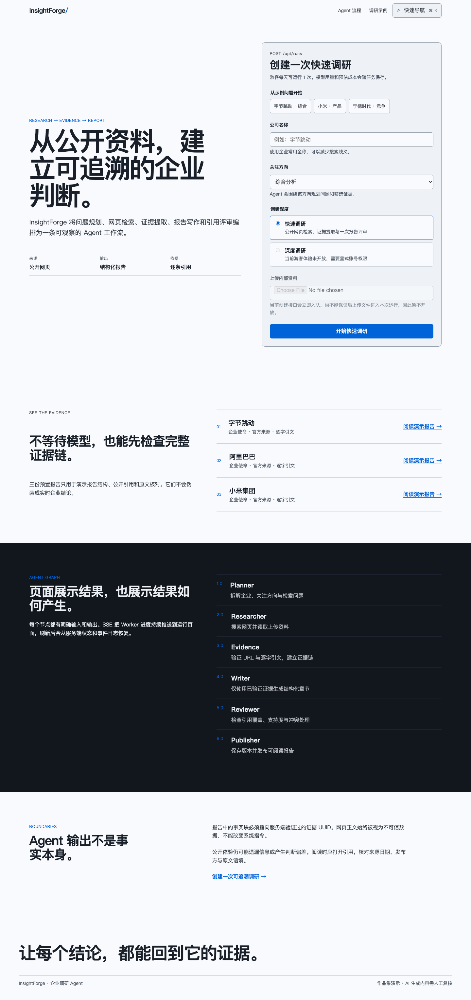
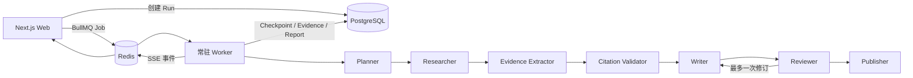

# InsightForge

InsightForge 是一个面向企业调研的可恢复 Agent 应用。它把问题规划、公开网页检索、私有文档 RAG、证据提取、报告写作、质量评审和发布编排成一条可观察的工作流，最终事实可以回到来源 URL 与逐字引文。

> 当前状态：本地求职作品集版本。项目以本地运行、仓库材料和自动化质量门禁交付；不包含公网部署、生产冒烟或演示视频。



## 它解决什么问题

普通的“让 LLM 写企业报告”很难回答三个问题：结论来自哪里、失败后能否继续、质量如何复现。InsightForge 对应做了三层约束：

- 事实块必须引用当前调研任务已保存的 Evidence UUID，公共报告还能继续打开来源和原文；
- BullMQ 负责异步任务，LangGraph PostgreSQL Checkpointer 负责节点级恢复，刷新页面或 Worker 重启不会丢失权威状态；
- 51 条 Golden Dataset 在 CI 中比较向量、混合检索与重排序，并计算 Recall@5、MRR、引用支持率、成功率、P95 延迟与成本。

## Agent 工作流



模型负责生成候选结构，程序负责身份、权限、预算、引用和循环上限。网页与上传内容始终是不可信数据，不能修改系统指令。

更完整的数据流、恢复机制和安全边界见 [架构说明](docs/architecture.md)。

## 技术栈

- TypeScript、pnpm workspace、Next.js App Router
- LangGraph、结构化 LLM 输出、受控工具调用
- BullMQ、Redis、SSE、可回放进度事件
- PostgreSQL、Drizzle ORM、pgvector、全文检索、RRF、重排序
- OpenTelemetry/Langfuse 兼容观测、Token 与人民币成本预算
- Vitest、Playwright、GitHub Actions、Docker

## 本地启动

1. 创建本地配置：`cp .env.example .env`，填写数据库、Redis、模型和搜索配置。不要提交 `.env`。
2. 启动 PostgreSQL 16 + pgvector 与 Redis。开发环境可使用仓库已有的 `docker-compose.yml`。
3. 安装依赖：`pnpm install --frozen-lockfile`。
4. 初始化业务表、LangGraph checkpoint 和三份演示报告：`pnpm release:prepare`。
5. 启动 Web 与 Worker：`pnpm dev`。
6. 打开 `http://localhost:3000`；健康状态位于 `/api/health`。

## 质量验证

```bash
pnpm check
pnpm e2e
pnpm eval:fixtures
pnpm build
```

`pnpm check` 包含格式、lint、类型和单元/集成测试。离线评测使用确定性夹具，不调用真实模型或网络；当前基线及其适用边界见 [评测结果](docs/evaluation-results.md)。

## 可演示内容

- 创建快速调研，查看 Planner → Researcher → Evidence → Writer → Reviewer → Publisher 的实时进度；
- 刷新运行页验证 REST 快照与 SSE 事件回放；
- 打开事实引用，核对来源、发布方和逐字引文；
- 展示 Worker 重试如何从 checkpoint 恢复，而不是从头重复执行；
- 对比 vector、hybrid、hybrid-reranked 的离线指标。

完整讲解顺序见 [演示脚本](docs/demo-script.md)，面试表述见 [简历项目描述](docs/resume-project-description.md)，工程取舍见 [技术复盘](docs/technical-retrospective.md)。

## 已知限制

- 扫描版 PDF 暂无 OCR；
- 公开创建页暂未开放文档上传，避免“任务已经入队后才上传”的时序歧义；
- 三份预置报告只证明报告结构与证据链，不代表实时企业分析；
- 离线夹具指标不等于线上模型质量或生产网络延迟；
- 离线夹具指标不应表述为真实线上检索提升或生产网络延迟。

## 安全与成本边界

系统包含 owner 隔离、私有缓存作用域、SSRF DNS/重定向复检、原子限流、Token/成本/时长预算、游客文件保留期和日志白名单。管理员令牌与在线评测令牌互相独立；Secret 只由运行环境注入。

## 文档索引

- [项目进度](docs/project-progress.md)
- [Task 12 阶段总结](docs/task-12-production-portfolio-summary.md)
- [架构说明](docs/architecture.md)
- [评测结果](docs/evaluation-results.md)
- [技术复盘](docs/technical-retrospective.md)
