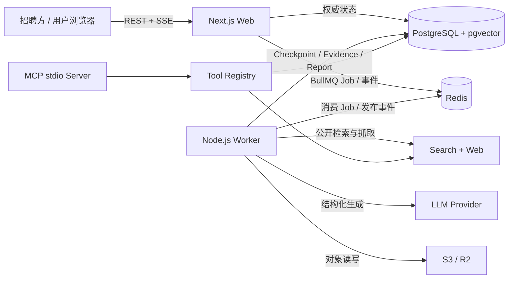
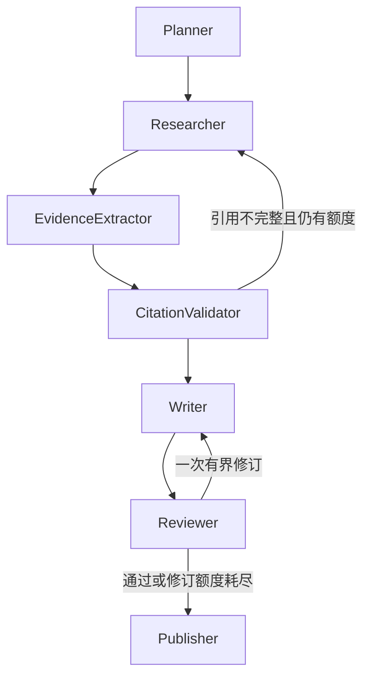

# InsightForge 架构说明

## 系统边界

Web 不执行耗时 Agent 工作流，只负责鉴权、创建任务、查询状态、SSE 和报告读取。Worker 是常驻进程，从 BullMQ 消费任务并运行 LangGraph。PostgreSQL 是运行、证据、报告、用量和 Checkpoint 的权威数据源；Redis 只承担队列、限流、缓存、取消标志与短期进度事件。

## Agent Graph

Graph 的循环由程序条件边与预算控制，而不是让模型自由决定是否继续。每个外部模型和搜索调用都有超时、取消与 Token/成本限制。Publisher 只发布引用身份、所有者和支持度校验通过的报告。

## 数据恢复

BullMQ 负责 Job 重试，LangGraph PostgreSQL Checkpointer 负责节点级恢复。Worker 重启后读取最新 StateSnapshot；已经提交的节点不会重新运行。网页 Evidence、报告版本和文档摄取使用稳定 ID 或唯一索引实现幂等写入，避免 checkpoint 提交前崩溃造成重复副作用。

## 安全边界

- ownerId 只来自服务端身份上下文，模型和请求体不能覆盖；
- 网页和上传文本始终包装为不可信数据；
- URL、DNS 结果和每次重定向都执行 SSRF 检查；
- 私有检索的缓存键、SQL 和向量查询全部包含 owner 与文档集合；
- 公共报告只返回已发布版本和公开网页引用；
- 管理员与在线评测使用不同令牌；
- Trace 只记录白名单元数据，不记录 Prompt、网页正文、私有文档或 Secret。
