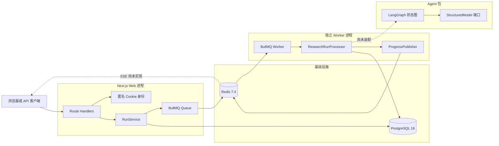
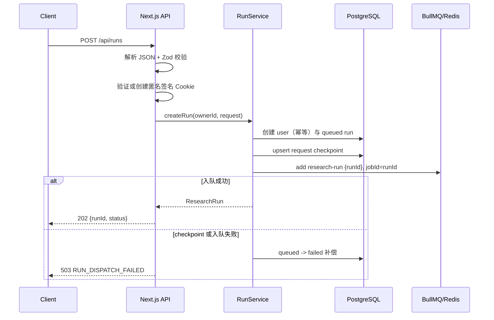
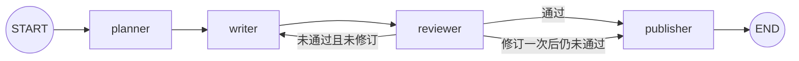

# InsightForge 后端技术文档

> 文档基线：2026-08-20，提交 `7a5e33c` 及其当前工作区实现。  
> 适用范围：`apps/web`、`apps/worker`、`packages/domain`、`packages/db`、`packages/agent`、本地基础设施与质量工具。  
> 判断原则：以依赖声明、实际 `import`、运行配置和测试为准；实施计划中的未来能力不会写成“已经完成”。

## 1. 文档目的与结论

InsightForge 当前采用 TypeScript 单仓库和 Web/Worker 分离架构：Next.js API 接收请求，PostgreSQL 保存权威业务状态，BullMQ/Redis 承载异步任务和短期事件，独立 Worker 负责消费任务，LangGraph.js 定义结构化 Agent 图，Zod 统一跨层运行时契约。

当前代码已经具备数据库持久化、任务 API、BullMQ 队列、Worker 核心组件、取消信号、进度事件发布和 LangGraph 图；但尚未形成可完整启动的生产链路。最关键的边界是：Worker 入口缺失、Worker 与 Agent 未装配、没有真实模型适配器、没有 SSE 消费端，也没有在工作流结束后持久化最终状态与报告。

本文使用三种状态：

- **已接入**：有实际运行代码和对应测试，可被当前应用路径调用。
- **组件已实现**：核心模块存在并经过测试，但生产调用链尚未打通。
- **仅预留**：只有数据结构、环境变量或设计，没有对应业务执行代码。

## 2. 技术栈总表

| 层次              | 技术与当前版本                         | 项目用途                                         | 当前状态                                                   |
| ----------------- | -------------------------------------- | ------------------------------------------------ | ---------------------------------------------------------- |
| 运行时            | Node.js `>=26.5.0 <27`                 | Web Node Runtime、Worker、脚本与测试             | 已接入；当前本机验证环境为 Node 25.2.1，会出现 engine 警告 |
| 语言              | TypeScript `6.0.3`、ESM                | 全仓静态类型、模块和领域契约                     | 已接入                                                     |
| 单仓库            | pnpm `11.17.0` Workspace               | 管理 `apps/*`、`packages/*` 和内部依赖           | 已接入                                                     |
| Web/API           | Next.js `16.2.12` Route Handlers       | 创建、查询和取消调研任务                         | 已接入                                                     |
| 运行时校验        | Zod `4.4.3`                            | API、Job、事件、领域对象和模型输出校验           | 已接入                                                     |
| 主数据库          | PostgreSQL 16                          | 权威业务状态、检查点、证据、报告、用量           | 已接入                                                     |
| 数据库扩展        | `pgcrypto`                             | `gen_random_uuid()`                              | 已接入                                                     |
| 向量扩展          | pgvector                               | 1536 维向量列和 HNSW 余弦索引                    | 仅完成 Schema/迁移，尚无摄取或检索代码                     |
| ORM               | Drizzle ORM `0.45.2`                   | 类型化 Schema、查询、事务和 Repository           | 已接入                                                     |
| 数据库驱动        | postgres.js `3.4.9`                    | PostgreSQL 连接池与 SQL 传输                     | 已接入                                                     |
| 迁移工具          | Drizzle Kit `0.31.10`、dotenv `17.4.2` | 生成、检查和执行 SQL 迁移；CLI 读取根目录 `.env` | 已接入                                                     |
| 缓存/消息基础设施 | Redis `7.4`                            | BullMQ、取消键、事件序号、回放日志和 Pub/Sub     | 已接入基础设施；端到端链路未完成                           |
| Redis 客户端      | ioredis `5.11.1`                       | Web Producer 与 Worker Redis 连接                | 已接入                                                     |
| 任务队列          | BullMQ `5.81.2`                        | 异步投递、消费、重试、退避和 stalled 恢复        | 组件已实现；Worker 启动入口缺失                            |
| Agent 编排        | LangGraph.js `1.4.10`                  | planner/writer/reviewer/publisher 状态图         | 组件已实现；尚未接入 Worker                                |
| LangChain 基础包  | `@langchain/core 1.2.8`                | Agent 包依赖                                     | 已声明；当前业务代码没有直接 import                        |
| 身份与签名        | Node.js `crypto`                       | 匿名 UUID、HMAC-SHA256 Cookie 签名与常量时间验签 | 已接入                                                     |
| 本地基础设施      | Docker Compose                         | 启动 PostgreSQL/pgvector 与 Redis                | 已接入                                                     |
| 测试              | Vitest `4.1.10`                        | 领域、Repository、API、Redis、Worker、Agent 测试 | 已接入                                                     |
| 开发执行器        | tsx `4.23.12`                          | Worker 开发脚本和 Agent 示例                     | 已声明；Worker 脚本因入口缺失暂不可用                      |
| 质量工具          | ESLint 10、Prettier 3.9                | 静态检查和格式检查                               | 已接入                                                     |
| CI                | GitHub Actions                         | 安装、格式、Lint、类型、迁移、测试、构建         | 已接入；当前 workflow 未配置 Redis Service                 |

以下能力目前**没有实际接入**，不能算作本项目已使用的后端技术：OpenAI SDK、Vercel AI SDK、真实模型供应商、搜索 API、对象存储、OpenTelemetry、Langfuse、SSE 服务端路由、Playwright 和 Testcontainers。`.env.example` 或实施计划中出现相关名称只表示预留。

## 3. 系统架构



架构中的实线表示已有组件调用或明确的数据通路，虚线表示相关组件已经存在但尚未接入生产链路。

### 3.1 模块职责

| 模块               | 职责                                               | 不应承担的职责                     |
| ------------------ | -------------------------------------------------- | ---------------------------------- |
| `apps/web`         | HTTP 协议、身份解析、参数校验、服务装配、任务投递  | 直接执行耗时 Agent 工作流          |
| `apps/worker`      | 队列消费、取消检查、状态迁移、进度发布、工作流启动 | 直接解析浏览器身份或返回 HTTP 响应 |
| `packages/domain`  | Zod 领域契约、跨进程消息、端口类型                 | 数据库查询或 Redis 网络访问        |
| `packages/db`      | Schema、连接、迁移、Repository、数据库一致性       | HTTP、BullMQ 和模型调用            |
| `packages/agent`   | LangGraph 状态、节点、路由和模型端口调用           | 绑定具体模型供应商或 Web 框架      |
| `packages/testkit` | 可预测的 Fake Model 等测试替身                     | 生产模型调用                       |

## 4. 核心请求与异步执行链路

### 4.1 创建调研任务



关键设计：

- 先验证请求，再创建身份和基础设施连接，无效输入不会产生额外副作用。
- PostgreSQL 是权威数据源；BullMQ Job 只携带 `{ runId }`。
- 原始请求中的 `documentIds` 不在 `research_runs` 表，而是保存在 `request` checkpoint。
- `jobId` 与数据库 `runId` 相同，便于关联日志并减少同一 Run 的重复队列记录。
- PostgreSQL 与 Redis 不能组成普通 ACID 事务。目前使用失败补偿，不是 Transactional Outbox。

### 4.2 Worker 消费

已实现的 Processor 顺序如下：

1. 使用 Zod 再校验来自 Redis 的 Job Data。
2. 检查 `run:<runId>:cancelled`。
3. 从 PostgreSQL 读取 Run；记录不存在时抛 `UnrecoverableError`。
4. 对 `awaiting_review/completed/failed/cancelled` 幂等返回。
5. 使用 `WHERE id=? AND status='queued'` 将状态乐观迁移为 `running`。
6. 发生状态冲突时重新读取，以数据库最新状态为准。
7. 再次检查取消信号。
8. 向 Redis 发布 5% 的 `starting` 进度事件。
9. 调用注入的 `workflow.run(runId)`。

普通异常向上抛给 BullMQ 触发重试；确定不可恢复的输入、缺失业务记录和取消状态使用 `UnrecoverableError` 停止无意义重试。

当前第 9 步只定义了端口，尚未装配 `packages/agent`；工作流成功或最终失败之后也没有把 Run 迁移到 `completed` 或 `failed`。

### 4.3 查询任务

`GET /api/runs/:runId` 的处理顺序：

1. 在创建 Cookie 和访问数据库之前校验 UUID。
2. 从签名 Cookie 得到服务端 `ownerId`。
3. 查询 Run，并在服务层校验所有权。
4. 不存在和越权统一返回 `404 RUN_NOT_FOUND`，防止资源枚举。
5. 响应不暴露 `ownerId`，并设置 `Cache-Control: private, no-store`。

### 4.4 取消任务

`POST /api/runs/:runId/cancel` 采用协作式取消：

1. PostgreSQL 先将可取消状态迁移为 `cancelled`。
2. Redis 写入 `run:<runId>:cancelled=1`，TTL 为 24 小时。
3. Worker 在安全边界调用 `CancellationGuard`，命中时抛不可重试错误。
4. 重复取消会重新写入 Redis 信号，便于修复上次写信号失败。

Redis 写入失败时数据库已经是 `cancelled`，API 返回 `503 RUN_CANCELLATION_SIGNAL_FAILED`。这表示权威状态已保存，但正在运行的 Worker 可能暂时没有收到信号。

当前取消只在工作流启动前检查两次。真正的长任务接入后，必须在搜索、模型调用和持久化等外部操作之间继续检查，不能尝试强制中断任意 JavaScript 或 HTTP 请求。

## 5. Node.js、TypeScript 与 ESM

### 5.1 采用方式

- 根 `package.json` 固定 Node.js 主版本范围和 pnpm 版本。
- `.nvmrc`、`.node-version` 都为 `26.5.0`。
- 所有业务包使用 `"type": "module"`。
- TypeScript 使用 `module: ESNext`、`moduleResolution: Bundler`、`target/lib: ES2024`。
- 开启 `strict`、`isolatedModules`、`verbatimModuleSyntax`、`noEmit`。
- `consistent-type-imports` 强制类型导入使用 `import type`。

### 5.2 项目意义

TypeScript 负责开发期约束，但不能验证 HTTP JSON、Redis Job、数据库行或模型输出，因此项目同时使用 Zod 作为运行时边界。两者的职责是：

- TypeScript：编译期发现代码类型错误。
- Zod：运行时拒绝不可信或跨进程数据。
- PostgreSQL 约束：即使绕过应用，也保护最终持久化数据。

### 5.3 注意事项

- 当前代码没有编译 Worker 生产产物，`tsx` 仅适合开发执行方案。
- `tsx` 位于 `devDependencies`；如果生产镜像只安装 production dependencies，即使补上 Worker 入口也无法执行现有 `start` 脚本。
- 开发和 CI 应使用项目声明的 Node 26.5.x，避免依赖行为与 engine 警告。

## 6. pnpm Workspace 单仓库

`pnpm-workspace.yaml` 收录 `apps/*` 和 `packages/*`。内部包通过 `workspace:*` 引用，例如 Web 引用 `@insightforge/db` 与 `@insightforge/domain`。

主要收益：

- Web、Worker、Agent 共享同一份领域契约。
- 依赖和锁文件集中管理。
- 根脚本可以递归执行 lint、typecheck 和 build。
- 各包仍能声明自己的运行依赖和测试项目。

仓库对 `esbuild`、`msgpackr-extract`、`sharp` 的安装构建脚本显式设为不允许运行。修改依赖后需要确认功能没有依赖被禁用的可选原生构建产物。

常用命令：

```bash
pnpm install --frozen-lockfile
pnpm lint
pnpm typecheck
pnpm test
pnpm build
pnpm check
```

`pnpm check` 依次执行 lint、typecheck 和 test；完整测试需要 PostgreSQL 测试库与 Redis。

## 7. Next.js Route Handlers

### 7.1 项目用法

当前 Web 使用 Next.js 16 App Router 的 Route Handlers：

| 方法   | 路径                      | 用途                       |
| ------ | ------------------------- | -------------------------- |
| `POST` | `/api/runs`               | 创建调研任务并投递 BullMQ  |
| `GET`  | `/api/runs/:runId`        | 查询当前匿名身份拥有的任务 |
| `POST` | `/api/runs/:runId/cancel` | 取消可取消状态的任务       |

三条路由都显式设置 `runtime = "nodejs"`，因为身份模块使用 `node:crypto`，数据库和 Redis 客户端也依赖 Node.js 环境，不能误部署到 Edge Runtime。

### 7.2 API 契约

创建请求示例：

```json
{
  "company": "ByteDance",
  "focus": "technology",
  "depth": "quick",
  "documentIds": []
}
```

字段约束：

- `company`：trim 后 2–120 字符。
- `focus`：`comprehensive/product/technology/business/competition`。
- `depth`：`quick/deep`。
- `documentIds`：最多 10 个 UUID，默认空数组。
- Schema 为 strict，未知字段会被拒绝。
- `ownerId` 不能由客户端提交，只能来自服务端身份。

成功响应：

```json
{
  "runId": "550e8400-e29b-41d4-a716-446655440000",
  "status": "queued"
}
```

### 7.3 稳定错误格式

```json
{
  "code": "INVALID_REQUEST",
  "message": "创建调研任务的参数无效",
  "issues": [
    {
      "path": "company",
      "message": "Too small",
      "code": "too_small"
    }
  ]
}
```

| 场景                       | HTTP | 错误码                           |
| -------------------------- | ---: | -------------------------------- |
| JSON 无法解析              |  400 | `INVALID_JSON`                   |
| 创建参数不符合 Schema      |  400 | `INVALID_REQUEST`                |
| runId 不是 UUID            |  400 | `INVALID_RUN_ID`                 |
| Run 不存在或不属于当前身份 |  404 | `RUN_NOT_FOUND`                  |
| 创建后无法投递             |  503 | `RUN_DISPATCH_FAILED`            |
| DB 已取消但 Redis 信号失败 |  503 | `RUN_CANCELLATION_SIGNAL_FAILED` |
| 未分类内部异常             |  500 | `INTERNAL_ERROR`                 |

当前实现对 `RUN_NOT_CANCELLABLE` 返回 400，但对应测试期望 409。两者尚未统一；对外发布前应确定契约并同步实现、测试和本文档。

### 7.4 资源缓存

用户私有的查询和取消响应使用 `private, no-store`。创建响应当前未显式设置同一响应头；若经过共享代理，应统一检查所有含身份 Cookie 或私有状态的响应缓存策略。

## 8. Zod 运行时契约

Zod 是跨边界数据的运行时权威定义，TypeScript 类型通过 `z.infer` 派生。主要使用位置：

- `CreateRunRequestSchema`：HTTP 创建请求。
- `ResearchRunJobSchema`：Web 与 Worker 的 Redis Job 协议。
- `RunProgressEventSchema`：Redis 与未来 SSE 的事件协议。
- `ResearchRunSchema`、`RunCheckpointSchema`：Repository 返回对象。
- `EvidenceSchema`、`ReportVersionSchema`：证据和报告领域约束。
- `ResearchPlanSchema`、`ReportDraftSchema`、`ReviewResultSchema`：模型结构化输出。

边界策略：

- HTTP 路由使用 `safeParse`，将问题转换成 4xx 响应。
- 服务、Repository、Worker 和 Agent 内部通常使用 `parse`，失败即抛出异常。
- 跨进程对象使用 `.strict()`，避免协议静默接受未知字段。
- JSONB 状态使用递归 `JsonValueSchema`，排除 Date、函数和类实例。
- 领域校验与 PostgreSQL check/enum/foreign key 双层保护。

更新跨进程 Schema 时，需要同时检查 Web Producer、Worker Consumer、Redis 历史 Job 和部署顺序。破坏性变更应考虑版本字段或兼容解析策略。

## 9. PostgreSQL 16、pgcrypto 与 pgvector

### 9.1 权威数据源

PostgreSQL 保存可恢复和需要长期一致性的业务事实。Redis 中的队列、取消键和短期事件不能代替数据库记录。

当前九张表：

| 表                | 作用                    | 关键约束/索引                                                |
| ----------------- | ----------------------- | ------------------------------------------------------------ |
| `users`           | 匿名或未来注册用户      | 主键为 VARCHAR(128)，ownerId 最长 128 字符；email 唯一且可空 |
| `research_runs`   | 调研任务与生命周期      | owner/status/created 索引；Token 与成本非负                  |
| `run_checkpoints` | 工作流阶段状态          | `(run_id, checkpoint_key)` 唯一                              |
| `documents`       | 上传或网页文档元数据    | `(run_id, content_hash)` 唯一；SHA-256 格式检查              |
| `document_chunks` | 文档分块和向量          | `(document_id, chunk_index)` 唯一；1536 维向量 HNSW          |
| `evidence`        | 标准化结论、引用和来源  | `(run_id, content_hash)` 唯一；来源一致性检查                |
| `reports`         | 每次 Run 的报告主记录   | `run_id` 唯一                                                |
| `report_versions` | 不可变报告版本          | `(report_id, version)` 唯一；发布状态一致性                  |
| `usage_events`    | 模型/工具用量和成本事件 | run/owner/time 索引；Token 和成本非负                        |

### 9.2 PostgreSQL 能力的实际使用

- `pgcrypto` 提供 `gen_random_uuid()`。
- PostgreSQL enum 防止脚本绕过应用写入非法状态。
- foreign key 配合 `CASCADE` 或 `SET NULL` 管理引用生命周期。
- JSONB 保存检查点、报告内容、Chunk metadata 和用量 metadata。
- `numeric(12,6)` 保存人民币成本；Repository 将驱动返回的字符串转为 number。
- check constraint 约束非负数、置信度范围、页码、Hash 和来源一致性。
- unique index 支撑 upsert、幂等写入和版本唯一性。
- `SELECT ... FOR UPDATE` 串行化同一报告的版本号分配。

### 9.3 pgvector 当前边界

`document_chunks.embedding` 为 1536 维 `vector`，建立 HNSW `vector_cosine_ops` 索引。这只代表存储和索引基础已经存在；当前没有：

- 文档解析与切块执行器；
- Embedding 模型或批处理；
- 向量写入 Repository；
- 余弦相似度查询；
- PostgreSQL 全文检索、RRF 融合或重排序；
- owner/document 过滤后的混合 RAG。

接入 Embedding 模型前必须确认输出维度为 1536。更换维度需要新迁移，不能只修改 TypeScript Schema。

### 9.4 当前数据完整性边界

除“尚未实现向量检索”外，现有 Schema 还需要注意以下边界：

- 当前没有 PostgreSQL Row-Level Security。`RunRepository.get(runId)`、`EvidenceRepository.listForRun(runId)` 和 `ReportRepository.getPublished(reportId)` 也没有把 ownerId 放进 SQL 条件；租户隔离依赖上层服务正确鉴权。
- 多张子表同时保存 `runId` 和 `ownerId`，但数据库只分别验证这些 ID 存在，没有约束它们一定属于同一用户或同一任务。保存 Document/Evidence/Report 时仍需做关联一致性检查。
- `evidence.document_id` 外键采用 `ON DELETE SET NULL`，而文档来源证据的 check constraint 又要求 `document_id IS NOT NULL`。删除仍被文档证据引用的 Document 可能因约束冲突失败；需要明确软删除、级联删除或保留证据中的一种策略。
- `report_versions` 的“不可变”由 Repository 使用方式保证，数据库没有阻止直接 `UPDATE`/`DELETE`。
- `transition(expected, next)` 防止并发覆盖，但数据库没有合法状态迁移表；只要 expected 匹配，Repository 技术上可以在任意枚举状态之间迁移。
- SHA-256 格式检查允许大写和小写，而唯一索引区分大小写。写入前应统一转为小写，避免相同摘要以不同大小写绕过去重。
- `numeric` 在 Repository 边界被转换为 JavaScript `number`。当前展示和估算可接受；若未来用于精确计费结算，应保留字符串或采用 Decimal 类型。
- `documents`、`document_chunks` 和 `usage_events` 已有表，但尚无完整 Domain Schema 与 Repository。

## 10. Drizzle ORM、postgres.js 与迁移

### 10.1 分工

| 组件        | 职责                                          |
| ----------- | --------------------------------------------- |
| Drizzle ORM | TypeScript Schema、类型化 SQL、事务和返回类型 |
| postgres.js | 真实网络连接、连接池和 PostgreSQL 协议        |
| Drizzle Kit | 根据 Schema 生成、检查和执行迁移              |
| dotenv      | 仅在 Drizzle CLI 配置中读取仓库根 `.env`      |

### 10.2 连接策略

`createDatabase()` 只接受 `postgres:` 和 `postgresql:` URL，并返回 `{ db, client, close }`。关闭函数幂等，并给 postgres.js 最多 5 秒结束连接。

| 进程        | 最大连接数 | idle timeout | connect timeout | 缓存方式                                  |
| ----------- | ---------: | -----------: | --------------: | ----------------------------------------- |
| Web         |         10 |        20 秒 |           10 秒 | `globalThis`，避免 Next.js 热更新重复建池 |
| 单个 Worker |          5 |        20 秒 |           10 秒 | 进程模块单例                              |

部署多个 Worker 时，数据库连接预算约为 `Worker 副本数 × 5 + Web 副本连接数`，还要为迁移、管理工具和平台保留余量。

### 10.3 Repository 模式

业务层依赖窄端口或领域对象，不直接依赖 Drizzle 表：

- `RunRepository.create`：事务中幂等创建用户并创建 Run。
- `RunRepository.transition`：expected-status 乐观并发控制。
- `RunRepository.saveCheckpoint`：联合唯一键上的 upsert。
- `EvidenceRepository.upsert`：按 runId + contentHash 幂等保存。
- `ReportRepository.createVersion`：事务、主记录行锁和递增版本号。
- `ReportRepository.getPublished`：只返回最新发布版本，不泄露草稿。

### 10.4 迁移工作流

```bash
pnpm --filter @insightforge/db db:generate
pnpm --filter @insightforge/db db:check
pnpm --filter @insightforge/db db:migrate
```

迁移文件、snapshot 和 journal 必须一起提交。已应用的迁移不应直接修改；Schema 变化应生成下一条迁移并审查 SQL。

更完整的原理、CRUD、事务和排障见 [Drizzle ORM 零基础入门指南](./drizzle-orm-guide.md)。

## 11. Redis 7.4 与 ioredis

### 11.1 Redis 在本项目中的四种用途

1. BullMQ 内部队列、锁、重试和 Job 数据。
2. 24 小时取消标志。
3. 每个 Run 的事件序号和最近 200 条回放日志。
4. 实时进度 Pub/Sub Channel。

业务最终状态、报告、证据和长期审计不应只存在 Redis。

### 11.2 本地 Redis 配置

Docker Compose 使用 `redis:7.4-alpine`：

- AOF 持久化：容器重启后尽量保留队列数据。
- `maxmemory-policy noeviction`：内存不足时报错，不静默淘汰 BullMQ 键。
- 命名 Volume：保存 `/data`。
- `redis-cli ping` 健康检查。

`noeviction` 不等于容量无限；仍需监控内存、连接数和队列清理。

### 11.3 Web 与 Worker 连接策略

| 配置                   | Web Producer       | Worker                                  |
| ---------------------- | ------------------ | --------------------------------------- |
| `maxRetriesPerRequest` | `1`，HTTP 快速失败 | `null`，满足 BullMQ Worker 持续等待要求 |
| `enableReadyCheck`     | `true`             | `true`                                  |
| `lazyConnect`          | `true`             | `true`                                  |
| `connectTimeout`       | 10 秒              | 10 秒                                   |
| URL 协议               | `redis:`/`rediss:` | `redis:`/`rediss:`                      |

Web 使用 `globalThis` 复用连接，Worker 使用独立全局键，二者不能误共享。BullMQ Worker 会为阻塞读取创建额外连接，连接预算不能只按传入的一条 ioredis 实例计算。

### 11.4 业务 Key

| Key                       | 类型            |             保留时间 | 用途              |
| ------------------------- | --------------- | -------------------: | ----------------- |
| `run:<id>:cancelled`      | String          |              24 小时 | 协作式取消        |
| `run:<id>:event-sequence` | Integer         |              24 小时 | Run 内单调事件 ID |
| `run:<id>:event-log`      | List            | 24 小时、最多 200 条 | 未来 SSE 断线回放 |
| `run:<id>:events`         | Pub/Sub Channel |             不持久化 | 实时进度通知      |

当前 `INCR` 在 Redis `MULTI/EXEC` 之外。后续事务或网络失败时可能产生事件 ID 空洞；极端情况下 sequence key 也可能暂时没有 TTL。消费者必须把 ID 当作单调游标，而不是无空洞计数器。

## 12. BullMQ 异步任务队列

### 12.1 任务协议

```ts
const RESEARCH_RUN_QUEUE = "research-runs";
const RESEARCH_RUN_JOB = "research-run";

type ResearchRunJob = {
  runId: string;
};
```

Job 保持最小化，由 Worker 使用 `runId` 回源 PostgreSQL，避免 Redis 保存大文档或过期业务快照。

### 12.2 重试与保留

| 配置                 |            当前值 | 含义                      |
| -------------------- | ----------------: | ------------------------- |
| `attempts`           |                 4 | 首次执行 + 最多 3 次重试  |
| `backoff.type`       |       exponential | 指数退避                  |
| `backoff.delay`      |              2 秒 | 初始退避                  |
| `backoff.jitter`     |               0.2 | 降低同时重试拥堵          |
| `removeOnComplete`   | 24 小时 / 1000 条 | 控制成功 Job 内存         |
| `removeOnFail`       |    7 天 / 5000 条 | 保留排障窗口              |
| Worker `concurrency` |                 4 | 单进程最多并发处理数      |
| `maxStalledCount`    |                 1 | Worker 失联后最多恢复一次 |

### 12.3 投递语义与幂等

系统应按“至少一次”消费设计：网络分区、锁丢失、Worker 退出或重试都可能让处理器再次运行。

- `jobId=runId` 只能在对应 Job 仍保留于 Redis 时防止相同 ID 重复添加。
- Job 被清理后，同一 ID 可再次加入。
- HTTP 请求重试会创建新 Run，因此当前没有端到端 Idempotency-Key。
- 真正的幂等依赖 PostgreSQL 状态迁移、唯一约束、upsert 和可恢复 checkpoint。

### 12.4 当前生产阻塞

`apps/worker/package.json` 的 `dev`/`start` 指向 `src/index.ts`，但该文件不存在，因此目前不能启动实际消费者。入口还需要负责：

- 创建生产 `ResearchWorkflow`；
- 装配 `ResearchRunProcessor` 与 BullMQ Worker；
- Worker error/failed/completed 事件处理；
- `SIGTERM`/`SIGINT` 优雅关闭；
- 依次关闭 Worker、Redis 和 PostgreSQL；
- 健康检查或至少可观测的启动失败日志。

更完整的队列原理、监控和生产检查表见 [BullMQ 实战技术指南](./bullmq-guide.md)。

## 13. 进度事件与未来 SSE

`RunProgressEvent` 包含：

- 正整数 `id`；
- `runId`；
- `status/progress/warning` 事件类型；
- Run 状态、阶段、消息、0–100 进度；
- ISO 8601 时间；
- 可扩展 JSON `data`。

`ProgressPublisher` 的发布过程：

1. `INCR` 获得事件 ID。
2. 使用 Zod 构造完整事件。
3. 在一个 Redis `MULTI/EXEC` 中执行 `RPUSH`、`LTRIM`、两个 `EXPIRE` 和 `PUBLISH`。
4. 检查事务是否中止以及每条命令是否报错。

在所有命令正常执行时，`RPUSH` 排在 `PUBLISH` 之前，因此先写回放日志再实时发布。需要注意，Redis `MULTI/EXEC` 只保证命令成批、按序执行，不提供数据库式回滚：前面的单条命令执行失败时，后面的 `PUBLISH` 仍可能成功；当前代码只能在 `EXEC` 返回后发现该错误。若要严格保证“日志写入成功才发布”，应使用带显式错误控制的 Lua 脚本或调整发布协议。

当前尚无 `/events` API、`text/event-stream` 响应、`Last-Event-ID` 回放、`LRANGE`、Redis Subscribe、心跳或终态关闭逻辑。因此“事件发布”已实现，“客户端实时进度”尚未实现。

## 14. LangGraph.js 与模型端口

### 14.1 显式状态图



节点职责：

- `planner`：生成 1–8 个结构化调研问题。
- `writer`：生成报告草稿，或根据 Review 问题修订一次。
- `reviewer`：返回 passed、0–100 score 和问题列表。
- `publisher`：确定性发布；仍未通过时附人工复核质量警告。

图由服务端代码决定最大修订次数，模型不能自行产生无限循环。

### 14.2 LangGraph 状态

`StateSchema` 保存公司、关注方向、深度、计划、草稿、Review、发布报告和质量警告。`ReducedValue` 用于累加：

- `revisionCount`；
- `visitedNodes`；
- `tokenUsage`；
- `estimatedCostCny`。

每个节点只返回局部更新，不直接修改共享 State。

### 14.3 StructuredModel 端口

Agent 不直接绑定某家模型 SDK，而依赖：

```ts
interface StructuredModel {
  generate<T>(schema: ZodType<T>, input: ModelInput): Promise<ModelResult<T>>;
}
```

这让单元测试可使用 `FakeStructuredModel` 逐次返回确定响应，并由 Zod 验证输出。

当前没有真实模型 Adapter，不读取 `MODEL_API_KEY`，也没有模型名、超时、重试、流式输出、tool calling 或供应商结构化输出实现。`packages/agent` 也未被 Worker 依赖。当前可运行的 `stream-research-graph.ts` 只是 Fake Model 示例。

### 14.4 尚未实现的 Agent 能力

- 搜索、文档检索、证据标准化和引用；
- 持久化 LangGraph Checkpointer 和断点恢复；
- 从 `request` checkpoint 加载完整输入；
- 节点间取消检查；
- Token/成本 usage event 与 Run 汇总；
- 发布报告版本；
- 真实模型和工具适配器。

## 15. 匿名身份与 Node.js Crypto

当前不是完整账号系统，而是签名匿名身份：

1. 首次请求生成 UUID v4。
2. 使用 `AUTH_SECRET` 和 HMAC-SHA256 签名。
3. Cookie 值为 `<uuid>.<base64url-signature>`。
4. 后续请求使用 `timingSafeEqual` 验证签名。
5. 服务端构造 `ownerId = anonymous:<uuid>`。

Cookie 属性：

| 属性     | 值                               |
| -------- | -------------------------------- |
| 名称     | `insightforge_anonymous_session` |
| HttpOnly | `true`                           |
| Secure   | 仅生产环境 `true`                |
| SameSite | `lax`                            |
| Path     | `/`                              |
| Max-Age  | 30 天                            |

安全行为：

- `AUTH_SECRET` 必填且至少 32 字符。
- 签名错误、格式错误或 Secret 轮换后，创建新的匿名身份。
- 服务端不从请求体接收 ownerId。
- 404 合并“不存在”和“无权访问”，降低资源枚举风险。
- 内部数据库、Redis 和 Secret 错误不会原样返回客户端。

限制：Secret 轮换会让旧 Cookie 无法映射到原身份，匿名用户将失去旧任务访问能力。当前没有账号绑定、身份恢复、多设备登录或显式 CSRF Token；SameSite=Lax 只能提供部分跨站请求保护。

## 16. Docker Compose 本地基础设施

### 16.1 PostgreSQL

- 镜像：`pgvector/pgvector:pg16`。
- 默认数据库：`insightforge`。
- 端口：`5432`。
- 命名 Volume 保存数据库数据。
- `pg_isready` 健康检查。

### 16.2 Redis

- 镜像：`redis:7.4-alpine`。
- 端口：`6379`。
- AOF、noeviction、命名 Volume 和 `redis-cli ping` 健康检查。

### 16.3 本地启动

在仓库根目录执行：

```bash
docker compose up -d --wait postgres redis
pnpm --filter @insightforge/db db:migrate
pnpm --filter @insightforge/web dev
```

首次运行前，需要按进程分别准备配置：

- 仓库根 `.env`：供 `packages/db/drizzle.config.ts` 明确加载，主要用于 Drizzle Kit 迁移。
- `apps/web/.env.local` 或启动 Web 前显式导出的环境变量：供 Next.js 读取 `DATABASE_URL`、`REDIS_URL` 和 `AUTH_SECRET`。
- Worker：未来入口补齐后，通过部署平台或启动命令显式注入环境变量；当前 Worker 代码不会主动加载仓库根 `.env`。

可以从 `.env.example` 复制变量名和本地默认值，但必须更换 `AUTH_SECRET`。不要用示例 Secret 部署生产环境，也不要提交任何真实环境文件。仅创建仓库根 `.env` 不足以保证 Next.js Web 获得这些变量，因为 Next 默认从应用目录加载 `.env*`。

当前不要把 `pnpm dev` 当作完整启动命令，因为它会并行启动 Web 与 Worker，而 Worker 的 `src/index.ts` 尚不存在。

当前 Compose 只编排 PostgreSQL/pgvector 和 Redis，没有 Web/Worker Service，仓库也没有应用 Dockerfile；它是本地基础设施配置，不是完整生产部署方案。

Docker Compose 默认只创建 `insightforge` 数据库，不会自动创建 `.env.example` 中的 `insightforge_test`。运行 Repository 集成测试前，需要另外创建测试库、对该库执行迁移，并确认 `DATABASE_TEST_URL` 只指向测试环境。

## 17. 环境变量

### 17.1 当前生产代码实际读取

| 变量           | 使用方                   | 要求                              |
| -------------- | ------------------------ | --------------------------------- |
| `DATABASE_URL` | Web、Worker、Drizzle Kit | `postgres:` 或 `postgresql:` URL  |
| `REDIS_URL`    | Web Producer、Worker     | `redis:` 或 `rediss:` URL         |
| `AUTH_SECRET`  | Web 身份模块             | trim 后至少 32 字符，仅服务端保存 |
| `NODE_ENV`     | Cookie 配置              | `production` 时启用 Secure        |

### 17.2 测试读取

| 变量                | 用途                                                           |
| ------------------- | -------------------------------------------------------------- |
| `DATABASE_TEST_URL` | 真实 PostgreSQL Repository 集成测试                            |
| `REDIS_TEST_URL`    | BullMQ/Redis 集成测试；未设置时默认 `redis://localhost:6379/1` |

测试数据库必须与开发和生产数据库隔离。Redis 集成测试使用独立 DB 或唯一队列名，并在测试后只清理自己创建的队列，不能对不明归属的 Redis 执行 `FLUSHALL`。

Repository 集成测试不会自动创建或迁移测试库；缺少 `DATABASE_TEST_URL` 时会直接失败。本地准备流程必须包含“创建 `insightforge_test` + 对测试 URL 执行迁移”。

### 17.3 仅预留、当前未读取

- `MODEL_API_KEY`
- `SEARCH_API_KEY`
- `OBJECT_STORAGE_ENDPOINT`
- `OBJECT_STORAGE_ACCESS_KEY_ID`
- `OBJECT_STORAGE_SECRET_ACCESS_KEY`
- `OBJECT_STORAGE_BUCKET`
- `OTEL_EXPORTER_OTLP_ENDPOINT`
- `LANGFUSE_PUBLIC_KEY`
- `LANGFUSE_SECRET_KEY`

这些变量出现于示例配置，不代表对应 SDK 或服务已经接入。

## 18. 测试、Lint 与 CI

### 18.1 测试分层

- 领域单元测试：Zod 枚举、状态、JSON、证据和报告规则。
- Repository 集成测试：真实 PostgreSQL 的事务、upsert、约束、行锁和并发。
- Redis/BullMQ 集成测试：真实 Redis 的 Queue、Worker、进度事务和连接选项。
- Web 单元测试：Route Handler、身份、Provider、服务补偿与错误映射。
- Worker 单元测试：Job 校验、状态冲突、取消和依赖装配。
- Agent 单元测试：节点顺序、一次修订上限、Reducer、用量累计和 Fake Model。

### 18.2 常用验证

```bash
pnpm format:check
pnpm lint
pnpm typecheck
pnpm --filter @insightforge/db db:check
pnpm test
pnpm build
```

本文生成时的定向验证结果：

- `pnpm format:check`：通过。
- `pnpm lint`：通过。
- `pnpm typecheck`：通过。
- Agent/Domain/Worker 定向测试：76/76 通过。
- Web 非 Redis 定向测试：65/66 通过；唯一失败为取消冲突实现 400、测试期望 409。
- 当前命令运行在 Node 25.2.1，因此有项目要求 Node 26.5.x 的 engine 警告。

以上不是完整端到端测试。当前没有覆盖 Web → PostgreSQL → BullMQ → Worker → Agent → 最终报告的 E2E，也没有真实模型、恢复和长任务取消测试。

### 18.3 CI 已知问题

GitHub Actions 当前提供 pgvector PostgreSQL Service 并执行迁移，但没有 Redis Service。Redis/BullMQ 集成测试不会自动 skip，默认连接 localhost:6379/1，因此在全量 CI 前应补充 Redis Service 与 `REDIS_TEST_URL`。

根 `build` 使用 `pnpm -r build`，但 Worker 包没有 `build` 脚本；其他多个包的 `build` 也只是 `tsc --noEmit`。因此当前 CI 的 build 步骤不会生成或验证可部署的 Worker 制品，生产构建需要单独补齐。

## 19. 一致性、可靠性与故障语义

### 19.1 PostgreSQL 权威、Redis 协作

- Run 生命周期以 PostgreSQL 为准。
- Redis 队列负责调度，不保存唯一业务事实。
- Redis 取消键是加速信号，数据库 `cancelled` 才是权威状态。
- 进度事件是 UI/观测信息，不替代报告或状态持久化。

### 19.2 状态并发

`RunRepository.transition(runId, expected, next)` 将 expected status 放进 SQL `WHERE`。并发更新只有一个能成功，其余得到 `RUN_STATUS_CONFLICT`，避免较旧 Worker 覆盖较新状态。

### 19.3 双写与补偿

创建任务需要先写 PostgreSQL，再写 Redis。当前失败时尝试 `queued -> failed`，并在 `RunDispatchError` 中同时保留投递错误与补偿错误。

剩余风险：进程可能在数据库提交后、Redis 投递前退出；补偿本身也可能失败。若业务要求不丢任务，应实现 Transactional Outbox：在同一 PostgreSQL 事务写 Run 与 Outbox，再由独立发布器重试投递。

### 19.4 事件原子性

Redis `MULTI/EXEC` 让日志追加、裁剪、TTL 和 Pub/Sub 发布成批并按序执行，但不在命令错误时回滚；它也不是跨 PostgreSQL/Redis 事务。当前实现可能出现“日志命令失败但消息仍发布”的部分成功。最终状态应先提交 PostgreSQL，再发布“完成”事件；若事件日志与发布必须严格一致，应改用 Lua 或可恢复的消息协议。

## 20. 安全边界

当前已有：

- 所有外部 JSON 和 Job Data 的 Zod 校验。
- Cookie HMAC 签名、HttpOnly、生产 Secure、SameSite=Lax。
- 身份只能由服务端 Cookie 推导。
- 不存在和越权统一 404。
- 私有查询/取消响应 `private, no-store`。
- URL 协议白名单，拒绝把 HTTP URL 当作 DB/Redis 连接串。
- API 不回传基础设施错误、Secret 或内部堆栈。
- PostgreSQL 外键、enum、check 和 unique 约束。

上线前仍需：

- Redis 使用 TLS、认证和网络访问控制；数据库使用平台要求的 TLS。
- API 限流、匿名配额、模型预算和请求幂等键。
- Secret 管理与轮换方案。
- Origin/CSRF 策略确认。
- 结构化日志脱敏，禁止记录 Cookie、连接串密码、文档全文和模型密钥。
- 健康检查、审计、指标和 Trace。
- 上传文件大小、MIME、解析沙箱和对象存储权限控制。

## 21. 当前未完成项与优先级

### P0：阻止完整运行

1. 补充 Worker `src/index.ts` 和优雅关闭；当前 `dev/start` 会因入口缺失失败。
2. 让 Worker 依赖并装配 `@insightforge/agent`，提供生产 `ResearchWorkflow`。
3. 实现真实 `StructuredModel` Adapter；当前只有 Fake Model。
4. 在成功、最终失败和人工评审时持久化 Run 终态。
5. 持久化报告版本、Token、成本与 usage event，避免任务长期停在 `running`。

### P1：影响产品闭环与恢复

1. 实现 SSE 路由、事件回放、订阅、心跳和终态关闭。
2. 接入 PostgreSQL/LangGraph Checkpointer；当前重试会从头执行，可能重复模型成本。
3. 在工作流各外部操作之间检查取消，而不只在 Processor 开始阶段检查。
4. Worker 监听最终失败并把数据库状态改为 `failed`。
5. 统一 `RUN_NOT_CANCELLABLE` 的 400/409 HTTP 契约。
6. CI 添加 Redis Service。
7. 为 owner/run/document/report 关系增加数据库或 Repository 级一致性校验，评估 PostgreSQL RLS。
8. 解决文档证据外键 `SET NULL` 与非空业务 Check 之间的删除冲突。

### P2：生产强化

1. Transactional Outbox 或任务对账补偿。
2. HTTP Idempotency-Key、限流、配额和预算。
3. 结构化日志、OpenTelemetry/Langfuse、监控和告警。
4. Redis 环境前缀、连接预算与内存容量规划。
5. Web/Worker 健康检查和部署构建产物。
6. pgvector 摄取、混合检索、owner 过滤和检索评测。
7. 统一 Hash 为小写，并按计费精度决定是否引入 Decimal。
8. 若报告版本必须强不可变，增加数据库权限、触发器或只追加写策略。

## 22. 常见故障排查

| 错误/现象                           | 常见原因                      | 检查方向                             |
| ----------------------------------- | ----------------------------- | ------------------------------------ |
| `DATABASE_URL_REQUIRED`             | 未设置数据库连接串            | `.env`、进程环境、启动目录           |
| `DATABASE_URL_INVALID`              | URL 无法解析                  | 使用标准 PostgreSQL URL              |
| `DATABASE_URL_UNSUPPORTED_PROTOCOL` | 误用 HTTP 等协议              | 只允许 `postgres:`/`postgresql:`     |
| `REDIS_URL_REQUIRED`                | 未设置 Redis                  | `.env` 与部署变量                    |
| `REDIS_URL_INVALID`                 | URL 或主机名错误              | Redis 地址、端口和 DB 编号           |
| `REDIS_URL_UNSUPPORTED_PROTOCOL`    | 协议错误                      | 只允许 `redis:`/`rediss:`            |
| `AUTH_SECRET_REQUIRED`              | 身份 Secret 缺失              | 设置仅服务端可见的 Secret            |
| `AUTH_SECRET_TOO_SHORT`             | 少于 32 字符                  | 生成高熵长 Secret                    |
| `RUN_STATUS_CONFLICT`               | 并发状态已变化                | 重新读取数据库并按最新状态决定       |
| Job 一直 waiting                    | Worker 未启动或队列配置不一致 | 当前首先检查缺失的 Worker 入口       |
| Worker 提示 retries 配置            | 连接不是 Worker 专用配置      | `maxRetriesPerRequest` 必须为 `null` |
| 取消后仍执行                        | 工作流内未再次检查取消        | 在每个外部调用之间加 Guard           |
| 前端没有进度                        | 当前没有 SSE API/订阅         | 事件只发布到了 Redis                 |
| pgvector 查询不可用                 | 只有 Schema，无检索实现       | Embedding、写入与向量查询尚待开发    |
| CI Redis 测试失败                   | workflow 未启动 Redis Service | 添加 Redis Service 和测试 URL        |
| Node engine warning                 | 本机不是 Node 26.5.x          | 按 `.nvmrc`/`.node-version` 切换     |

## 23. 代码导航

| 主题             | 主要文件                                      |
| ---------------- | --------------------------------------------- |
| API Route        | `apps/web/app/api/runs/**/route.ts`           |
| 匿名身份         | `apps/web/lib/server/auth.ts`                 |
| 业务服务         | `apps/web/lib/server/run-service.ts`          |
| Web 依赖装配     | `apps/web/lib/server/run-service-provider.ts` |
| Web Redis        | `apps/web/lib/server/redis.ts`                |
| BullMQ Queue     | `apps/web/lib/server/research-queue.ts`       |
| Worker Redis/DB  | `apps/worker/src/redis.ts`、`database.ts`     |
| Worker 消费器    | `apps/worker/src/research-worker.ts`          |
| Worker Processor | `apps/worker/src/processors/research-run.ts`  |
| 取消 Guard       | `apps/worker/src/cancellation.ts`             |
| 进度发布         | `apps/worker/src/progress-publisher.ts`       |
| 跨进程协议       | `packages/domain/src/async-run.ts`            |
| 领域模型         | `packages/domain/src/*.ts`                    |
| DB Schema        | `packages/db/src/schema.ts`                   |
| DB 连接          | `packages/db/src/client.ts`                   |
| Repository       | `packages/db/src/repositories/*.ts`           |
| 迁移             | `packages/db/src/migrations/`                 |
| Agent 状态       | `packages/agent/src/state.ts`                 |
| Agent 图         | `packages/agent/src/graph.ts`                 |
| 本地基础设施     | `docker-compose.yml`                          |
| CI               | `.github/workflows/ci.yml`                    |

## 24. 技术决策摘要

- 使用 TypeScript 全栈和共享 Zod 契约，减少 Web、Worker、数据库与 Agent 之间的协议漂移。
- Web 与 Worker 分离，避免长时间 Agent 任务占用 HTTP 生命周期。
- PostgreSQL 保存权威状态，Redis 只承担队列和短期协作数据。
- BullMQ 按至少一次语义设计，数据库状态与唯一约束只提供部分幂等保护；当前 `running` 状态重入和未接入 Checkpointer 的工作流仍可能重复执行模型调用与副作用，尚不具备端到端幂等。
- Repository 隔离 Drizzle/PostgreSQL，服务与 Agent 依赖窄端口。
- LangGraph 使用显式节点和确定性路由，限制模型驱动的无限循环。
- 模型供应商通过 `StructuredModel` 隔离；当前仍需实现生产 Adapter。
- pgvector 先完成数据结构和索引，再接入摄取与混合检索；当前不宣称 RAG 已完成。

维护本文档时，应优先更新“技术栈总表”“API 契约”“环境变量”“未完成项”和版本号，并以当前代码与测试为准，而不是直接复制实施计划。
