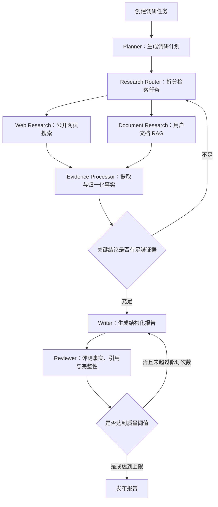

# InsightForge AI 企业调研与报告生成 Agent 设计

## 1. 项目概述

InsightForge AI 是一个用于求职作品集的企业调研与报告生成 Agent。用户输入一家上市公司或科技企业，可选上传 PDF、DOCX、Markdown 或 TXT 资料，系统会自主规划调研问题、检索公开网页、查询用户资料、提取和核验事实，并生成带引用的企业竞争力报告。

项目主要面向 Agent 应用开发工程师岗位，采用 TypeScript 全栈为主的技术路线，在八周内公开部署。它需要证明候选人具备全栈后端工程、LLM/RAG、Agent 工作流编排、评测观测和业务落地能力，而不只是完成一个大模型聊天 Demo。

## 2. 目标与成功标准

### 2.1 产品目标

- 招聘方无需安装项目即可访问公开网站和预生成示例报告。
- 用户可以创建一次快速或深度企业调研，实时查看执行进度和最终报告。
- 报告中的重要事实带有可回溯到原始网页或上传文档的引用。
- Agent 任务可以异步运行，并支持刷新后查看、取消、节点重试和服务重启恢复。
- 项目公开展示评测结果、运行耗时、资料数量和成本，而非使用主观描述评价效果。

### 2.2 作品集成功标准

- 公开部署一个稳定可访问的网站。
- 提供至少 3 份预生成企业报告。
- 建立覆盖 3 至 5 家企业、不少于 50 条样本的 Golden Dataset。
- 对基础向量检索、混合检索、混合检索加重排序进行可复现对比。
- 提供系统架构图、Agent 运行时间线、README、3 至 5 分钟演示视频和技术复盘。
- 简历项目描述能够使用任务成功率、引用支持率、P95 延迟和单次成本等真实指标。

## 3. 用户与核心场景

### 3.1 目标用户

主要用户是希望快速了解一家公司的求职者、分析人员或产品研究人员。作品集的直接评审者是招聘方和技术面试官。

### 3.2 核心流程

1. 用户输入公司名称。
2. 用户选择快速调研或深度调研，以及综合、产品、技术、商业或竞争重点。
3. 用户可选上传公开财报、新闻稿或研究资料。
4. 系统生成有限且可验证的调研计划。
5. 后台 Worker 搜索网页、检索用户文档并建立证据库。
6. 系统对关键事实进行来源归一化和交叉核验。
7. Writer 根据证据生成结构化报告。
8. Reviewer 检查事实支持度、引用、章节完整性和冲突。
9. 未达到质量阈值时自动修订一次；之后发布当前最佳版本，并明确标注剩余不确定性。
10. 用户查看报告、引用来源、执行时间线、资料数量、耗时和成本。

### 3.3 游客体验

- 游客无需登录即可浏览示例报告。
- 游客每日最多发起一次快速调研，具体额度通过服务端配置调整。
- 深度调研仅对演示账号开放。
- 达到额度或外部服务不可用时，界面引导用户浏览预生成报告，不暴露内部错误或密钥信息。

## 4. 报告定义

第一版采用固定结构，不提供任意模板设计器：

1. 执行摘要；
2. 公司概况；
3. 核心产品与商业模式；
4. 市场与竞争格局；
5. 技术与创新动态；
6. 近期重要事件；
7. 优势、风险与不确定性；
8. 结论；
9. 来源清单。

每项重要事实需要关联至少一条证据。证据保存页面标题、发布机构、发布时间、URL、抓取时间、原文片段、文档页码或章节以及来源可信度等级。缺乏充分支持的内容必须标注为推断或不确定信息，不能伪装成事实。

## 5. 系统架构

采用 TypeScript 全栈加独立 Agent Worker 的模块化单仓库架构：

- Web 应用：Next.js、React、TypeScript，负责页面、鉴权、任务创建、报告展示和 SSE 进度流。
- Agent Worker：Node.js、TypeScript、LangGraph.js，负责持久化图工作流、模型调用、工具调用和报告生成。
- 任务系统：BullMQ 与 Redis，负责任务排队、重试、取消信号和 Worker 调度。
- 数据库：PostgreSQL 与 pgvector，保存用户、运行、计划、证据、报告、评测和文档向量。
- 对象存储：S3 兼容存储，保存上传原文件和导出报告。
- 观测系统：OpenTelemetry 与 Langfuse，保存 Agent Trace、模型用量、步骤耗时和异常。

部署采用 Web 与 Worker 分离的方式。Web 可部署到 Vercel，Worker 部署到 Railway 或 Render，PostgreSQL 使用 Supabase 或 Neon，Redis 使用 Upstash，文件使用 Cloudflare R2。所有供应商通过接口封装，业务代码不直接依赖单个云平台。

## 6. Agent 工作流

Agent 使用显式状态图，不采用多个自由对话人格 Agent。



### 6.1 节点职责

- Planner：把报告章节拆成数量受限、可检索、可验证的问题。
- Research Router：选择公开网页、上传文档或两者同时检索。
- Web Research：调用搜索与网页抓取工具，过滤重复、低质量和无法读取的页面。
- Document Research：对当前用户上传文档进行带权限过滤的混合检索。
- Evidence Processor：提取主体、事实、时间、数值、来源和原文片段，合并重复事实并标记冲突。
- Writer：仅使用证据库生成报告，不直接把未审计的网页内容写入最终报告。
- Reviewer：计算章节覆盖、事实有引用率、引用支持度和冲突处理结果，输出结构化修订意见。
- Publisher：保存达到阈值或达到修订上限的报告，并附加 AI 生成和核验提示。

### 6.2 运行状态

```ts
type ResearchState = {
  runId: string;
  company: string;
  focus:
    "comprehensive" | "product" | "technology" | "business" | "competition";
  depth: "quick" | "deep";
  plan: ResearchQuestion[];
  completedQuestionIds: string[];
  evidenceIds: string[];
  reportDraftId?: string;
  review?: ReviewResult;
  revisionCount: number;
  status: RunStatus;
  tokenUsage: number;
  estimatedCostCny: number;
};
```

每个关键节点结束后写入 Checkpoint。系统必须支持刷新后查看、任务取消、可重试节点、服务重启恢复、最大搜索次数、最大修订次数、Token 预算和费用上限。重复的公司与配置可以复用未过期的搜索和抓取缓存，但用户私有文档结果不能跨用户共享。

## 7. RAG 设计

### 7.1 文档摄取

第一版支持 PDF、DOCX、Markdown 和 TXT：

1. 检查文件扩展名、MIME 和大小；
2. 保存原文件到对象存储；
3. 提取文本、标题层级、页码和文档元数据；
4. 清除重复页眉页脚和无意义空白；
5. 优先按标题层级切分，超长章节使用带重叠的递归切分；
6. 生成 Embedding 并写入 pgvector；
7. 保存文档、Chunk、页码和所有者关联。

扫描版 PDF OCR 不作为第一版承诺。解析不到有效文本时给出可理解的失败原因，不生成空索引。

### 7.2 检索

- PostgreSQL 全文检索提供关键词召回。
- pgvector 提供语义召回。
- Reciprocal Rank Fusion 合并两个候选集。
- 元数据过滤保证用户和文档权限隔离。
- 重排序器对融合结果重新排序。
- 返回结果带文档、章节、页码和原文片段。

## 8. 工具接口

第一版工具集合保持精简：

- `search_web`：根据查询返回标题、摘要、URL 和发布时间候选。
- `fetch_web_page`：读取并清洗允许访问的网页正文。
- `search_uploaded_documents`：在当前用户文档范围内检索。
- `get_evidence`：读取规范化证据详情。
- `save_evidence`：以幂等方式保存事实与来源关联。
- `publish_report`：发布已完成评审的报告版本。

所有工具必须使用 Zod 验证输入和输出，并具备超时、有限重试、幂等键、权限检查、结果大小限制、调用审计和明确的错误类别。发布、高成本操作和任何未来的外部写操作需要显式权限，模型不能绕过服务端策略。

第五周以后把搜索和文档检索工具通过 MCP 暴露，作为协议集成展示；内部工作流仍通过统一工具接口调用，MCP 不是基础流程的单点依赖。

## 9. 模型策略与成本治理

模型调用通过供应商无关的适配层完成：

- 规划、报告写作和评审使用质量较高的主模型。
- 查询改写、分类和事实抽取优先使用低成本模型。
- Embedding 使用独立嵌入模型。
- 结构化任务使用 JSON Schema，并在模型输出无效时只进行有限修复或重试。

成本治理包括游客额度、单任务 Token 与费用预算、最大搜索次数、最大修订一次、查询和网页缓存、相同公开调研结果缓存、低成本模型路由和预生成示例报告。管理视图展示每次运行的模型、Token、费用、缓存命中和步骤耗时。

## 10. 评测与观测

### 10.1 Golden Dataset

建立覆盖 3 至 5 家企业、不少于 50 条问题的版本化评测集，包括事实问答、比较问题、时间敏感问题、材料不存在、冲突来源、工具选择和不可回答问题。每条样本保存预期来源、关键事实、允许工具、禁止工具和最大步骤数。

### 10.2 指标

RAG 指标：

- Recall@5；
- MRR；
- 引用命中率；
- 引用支持度。

Agent 指标：

- 调研问题完成率；
- 工具选择正确率；
- 参数合法率；
- 运行成功率；
- 平均步骤数；
- 循环或超限率。

报告指标：

- 章节完整率；
- 事实有引用率；
- 引用支持率；
- 重要事实多来源覆盖率；
- 冲突事实识别率。

工程指标：

- P50 与 P95 运行耗时；
- 单次运行成本；
- 节点失败率；
- 重试成功率；
- 缓存命中率。

### 10.3 Trace

每次运行记录运行 ID、Prompt 版本、模型、输入输出摘要、工具参数和结果摘要、检索候选、Token、费用、步骤耗时、异常、重试和最终评审结果。敏感内容和用户原文不得无条件发送到第三方观测平台，日志需要脱敏并限制保留期限。

## 11. 错误处理与安全

系统需要明确处理以下故障：

- 搜索服务超时或额度耗尽；
- 网页无法访问、正文为空或内容过长；
- 文件格式不支持或解析失败；
- 模型输出不符合 Schema；
- 引用无法对应原文；
- Redis、数据库或 Worker 暂时中断；
- 用户取消任务；
- 运行超过步骤、Token、时间或费用预算。

网页和上传资料一律视为不可信数据。内容不能修改系统指令、工具白名单、预算和权限。系统实施游客限流、租户隔离、文件大小和格式限制、上传文件自动过期、Prompt Injection 防护、工具白名单、密钥隔离、审计日志和 AI 生成提示。

## 12. 测试策略

- 单元测试：状态转换、Chunk、检索融合、引用解析、工具参数、预算和费用计算。
- 集成测试：PostgreSQL、Redis、BullMQ、模型 Mock、工具调用、Checkpoint 和恢复。
- Agent 回归：Golden Dataset 定期运行并比较指标阈值。
- E2E：创建任务、查看 SSE 进度、取消、恢复、查看报告和打开引用。
- 故障测试：模型超时、搜索失败、Worker 重启、非法模型输出和预算超限。

CI 默认使用固定模型响应或录制结果，避免每次提交产生外部费用和随机失败。真实模型在线评测作为显式触发的独立流程运行。

## 13. 八周交付计划

| 周次    | 交付结果                                              |
| ------- | ----------------------------------------------------- |
| 第 1 周 | 单仓库骨架、数据库、鉴权、任务创建和部署流水线        |
| 第 2 周 | Agent 状态图、异步 Worker、SSE 进度、取消和恢复       |
| 第 3 周 | 网页搜索、抓取、证据提取和来源管理                    |
| 第 4 周 | 文件上传、解析、pgvector、混合检索和重排序            |
| 第 5 周 | 报告生成、引用、Reviewer、一次自动修订和 MCP 接口     |
| 第 6 周 | Golden Dataset、RAG/Agent 评测和 Langfuse 观测        |
| 第 7 周 | 限流、缓存、成本治理、安全和故障恢复                  |
| 第 8 周 | UI 打磨、公开部署、示例报告、README、架构图和演示视频 |

每周成果都必须能够独立运行和验收。后续周次可以增强已有能力，但不能以尚未实现的未来模块作为当前成果能够工作的前提。

## 14. 项目交付物

- 公开访问的网站；
- GitHub 源代码仓库；
- 至少 3 份预生成企业报告；
- 系统架构图和 Agent 数据流图；
- 可查看的 Agent 运行时间线；
- Golden Dataset 与评测脚本；
- 检索方案对比和性能结果；
- 完整 README；
- 3 至 5 分钟演示视频；
- 技术复盘文章；
- 可直接放入简历的项目描述。

## 15. 非目标

八周第一版不实现以下内容：

- 任意报告模板设计器；
- 团队协作、评论和复杂 RBAC；
- 企业付费与订阅；
- 大规模通用爬虫；
- OCR 质量承诺；
- 模型微调；
- 多个自由协作的人格 Agent；
- 原生移动应用；
- PPT 或 Word 高级排版；
- 自动执行任何对外发布、交易或其他高风险写操作。

## 16. 技术决策摘要

- 选择 TypeScript 全栈加独立 Worker，而不是 Next.js 单体或 Python 双语言服务。
- 选择显式 LangGraph 状态图，而不是自由多 Agent 对话。
- 选择 PostgreSQL 全文检索加 pgvector，并通过 RRF 与重排序构成混合检索。
- 选择固定企业竞争力报告，避免第一版支持任意报告类型。
- 选择公开网页与用户上传资料双通道，分别展示实时研究和私有 RAG。
- 选择公开部署加额度、预算、缓存和预生成示例，平衡可访问性和运行费用。
- 选择离线评测、在线 Trace 和业务指标共同证明效果。
